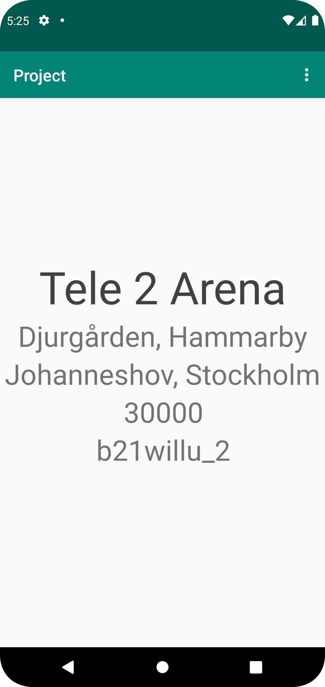
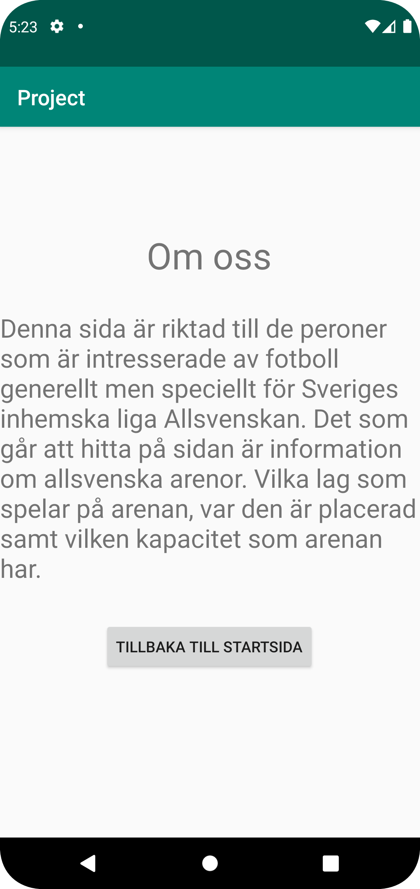

Projekt rapport.

Det första som gjordes till projektet var att skapa den data som sedan ska visas upp i appen.
Den data som jag valt att skapa handlar om Allsvenska fotbollsarenor, och innehåller namn på arenorna, vilka klubbar som spelar där, var den är placerad samt vilken kapacitet arenan har.


När datan var klar så börjades det med att fixa koden i Android Studio.
Det första som gjordes var att skapa en RecyclerView som skulle kunna hämta och presentera den data som tidigare skapats.
En RecyclerView widget lades till i layout filen för MainActivity.
Sen lades en ny layout fil till med namnet list_items som fylldes med fem TextViews som ska presentera datan som hämtas.
Till den nya layout filen skapades en ny java klass (Arenas) som ska representera alla list_items.
Koden till Arenas klassen ser ut såhär:

```
public class Arenas {
    private final String ID;
    private final String name;
    private final String company;
    private final String location;
    private final int size;

    public Arenas(String ID, String name, String company, String location, int size  ) {
        this.ID = ID;
        this.name = name;
        this.company = company;
        this.location = location;
        this.size = size;
    }

    public String getId() {
        return ID;
    }

    public String getName() {
        return name;
    }

    public String getCompany() {
        return company;
    }

    public String getLocation() {
        return location;
    }

    public int getSize() {
        return size;
    }

}
```

När detta var klart så börjades det med RecyclerView, RecyclerViewAdapter och ViewHolder.
Först lades det till två nya medlems variabler i MainActivity en för RecyclerView och en för ArrayList<>.
Sedan lades kod till i onCreate i MainActivity för RecyclerView bl.a. för att hitta RecyclerView i layout filen (findViewByID) och för att sätta en layoutManager (setLayoutManager) och sist för att sätta en adapter (setAdapter).
arenasArrayList instantierades med arenasArrayList = new ArrayList<>();
Sen sattes adaptern med RecyclerViewAdapter(arenasArrayList).

Koden för detta ser ut såhär:

 ```
 MainActivity:
     @Override
     protected void onCreate(Bundle savedInstanceState) {

         recyclerView = findViewById(R.id.recycler_view);
         arenasArrayList = new ArrayList<>();
         adapter = new RecyclerViewAdapter(arenasArrayList);
         recyclerView.setLayoutManager(new LinearLayoutManager(this));
         recyclerView.setAdapter(adapter);

         ...
     }
 ```


RecyclerViewAdapter:

Det som gjordes nu var att en RecyclerViewAdapter skapades i en egen klass.
En medlems variabler för List<Arenas> arenasList lades till.
Till RecyclerViewAdapter skapades sen tre metoder onCreateViewHolder, onBindViewHolder och getItemCount.
onCreateViewHolder visar data ifrån list_items filen.
onBindViewHolder hämtar datan ifrån Arenas klassen.
getItemCount räknar antal objekt i Arenas listan.
Sist i RecyclerViewAdapter klassen så skapades en ViewHolder med medlemsvariabler för TextViews och sedan så sätts det vilken variabel som ska sättas i vilken TextView med findViewById.
Denna kod ser ut som såhär:


 ```
 public class RecyclerViewAdapter extends RecyclerView.Adapter<RecyclerViewAdapter.MyViewHolder> {

     List<Arenas> arenasList;

     public RecyclerViewAdapter(List<Arenas> arenasList) {
         this.arenasList = arenasList;
     }

     @NonNull
     @Override
     public MyViewHolder onCreateViewHolder(@NonNull ViewGroup parent, int viewType) {
         View itemView = LayoutInflater.from(parent.getContext()).inflate(R.layout.list_items, parent, false);
         return new MyViewHolder(itemView);
     }

     @Override
     public void onBindViewHolder(@NonNull MyViewHolder holder, int position) {
         holder.id.setText(arenasList.get(position).getId());
         holder.name.setText(arenasList.get(position).getName());
         holder.company.setText(arenasList.get(position).getCompany());
         holder.location.setText(arenasList.get(position).getLocation());
         holder.size.setText(String.valueOf(arenasList.get(position).getSize()));
     }

     @Override
     public int getItemCount() {
         return arenasList.size();
     }

     public static class MyViewHolder extends RecyclerView.ViewHolder {
         private final TextView id;
         private final TextView name;
         private final TextView company;
         private final TextView location;
         private final TextView size;


         public MyViewHolder(@NonNull View view) {
             super(view);
             id = view.findViewById(R.id.id);
             name = view.findViewById(R.id.name);
             company = view.findViewById(R.id.company);
             location = view.findViewById(R.id.location);
             size = view.findViewById(R.id.size);
         }
     }
 }
```
När RecyclerViewAdapter var klar så behövdes det skrivas kod i MainActivity för att få allt att funka.
Först så lades JSON task koden vi fick till uppgiften in.
Sedan skapades en String JSON_URL med url till webbtjänsten som datan hämtas ifrån. Och för att starta nedladdning av denna JSON data så skrevs koden new JsonTask.this.execute(JSON_URL); i onCreate.
När detta var klart så skrevs det kod i metoden onPostExecute i MainActivity för att parsea JSON datan.
För att parsea JSON datan så användes GSON biblioteket.
Först skapas ett GSON objekt för att kunna marshall/unmarshall.
Koden Type type = new TypeToken<ArrayList<Arenas>>() {}.getType(); och ArrayList<Arenas> list = gson.fromJson(json, type); används för att skapa en lista av objekt av JSON datan.
arenasArrayList.addAll(list); används för att uppdatera listan med objekt.
adapter.notifyDataSetChanged(); används för att säga till adaptern att den ska uppdatera innehållet i RecyclerView.

Koden ser ut såhär:
```
MainActivity

private final String JSON_URL = "https://mobprog.webug.se/json-api?login=b21willu";

    @Override
    protected void onCreate(Bundle savedInstanceState) {
        new JsonTask(this).execute(JSON_URL);
        ...
    }

    @Override
    public void onPostExecute(String json) {
        Gson gson = new Gson();
        Type type = new TypeToken<ArrayList<Arenas>>() {}.getType();
        ArrayList<Arenas> list = gson.fromJson(json, type);
        arenasArrayList.addAll(list);
        adapter.notifyDataSetChanged();
    }
```

Nu när RecyclerView var klart och det presenterar den datan som bestämts så skulle det skapas en ny "Om oss" sida som skulle vara en egen aktivitet.
Så för detta så skapades det först en ny aktivitet med namnet AboutActivity.
Sedan så ville jag att man skulle kunna navigera mellan sidorna med hjälp av en meny högst upp i högra hörnet.
Menyn gjordes genom att först skapa en ny resource file av typen meny och sedan en inre layout fil med namnet menu_main.xml.
I denna layout fil så lades det till ett item som sedan ska kunna ta oss till den nya sidan "Om oss".
För att få till funktionen av menyn så att en användare kan byta till en annan sida vid interaktion så lades koden onCreateOptionsMenu och onOptionsItemSelected in.
onCreateOptionsMenu koden lägger till objekt i menyn, i detta fall hämtar den items ifrån menu_main filen.
onOptionsItemSelected hanterar användarens klick i menyn och ifall den klickar på "Om oss" så aktiveras internal_web och då byts aktivitet.
Koden ser ut såhär:
```
   @Override
    public boolean onCreateOptionsMenu(Menu menu) {
        getMenuInflater().inflate(R.menu.menu_main, menu);
        return true;
    }


    @Override
    public boolean onOptionsItemSelected(MenuItem item) {

        int id = item.getItemId();

        if (id == R.id.internal_web) {
            Intent intent = new Intent(MainActivity.this,AboutActivity.class);
            startActivity(intent);
        }

        return super.onOptionsItemSelected(item);
    }
```

Nu så skulle bara AboutActivity få sin layout.
Två TextViews lades till i activity_about.xml och en button.
Button skulle användas för att ta tillbaka användaren till startsidan.
Detta gjordes genom att först skapa en medlems variabel för button (Button button), sedan sattes variabeln med findViewById för att hitta button widgeten.
Och sedan skrevs en setOnClickListener innehållandes Intent intent = new Intent(AboutActivity.this, MainActivity.class) och startActivity(intent).
Koden i AboutActivity ser ut såhär:
```
AboutActivity:

    Button button;

    @Override
    protected void onCreate(Bundle savedInstanceState) {

        button = findViewById(R.id.button);
        button.setOnClickListener(new View.OnClickListener() {
            @Override
            public void onClick(View view) {
                Intent intent = new Intent(AboutActivity.this, MainActivity.class);
                startActivity(intent);
            }
        });
        ...

    }
```
Och det sista som gjordes var att styling på texterna i TextView fixades med ökade font storlekar och positionering, och texter lades in i strings för de olika TextViews.



Screenshots ifrån startsida som presenterar egenskapad data.


Screenshot ifrån Om oss sida.

